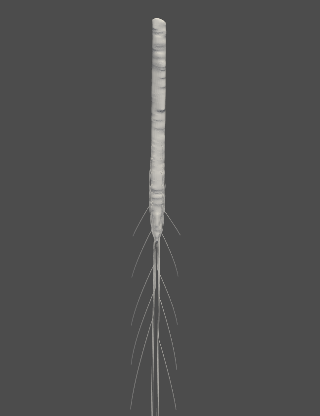
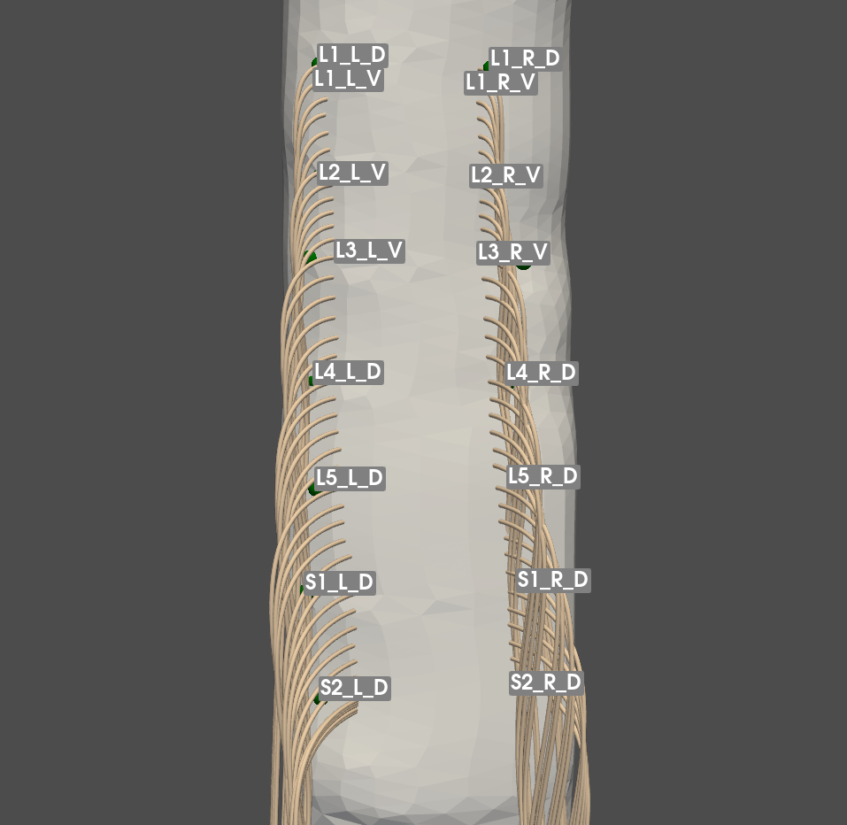
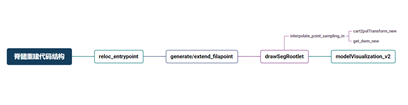

# SpinalCord_NerveRootlet
A method to draw the precise structure of the nerve rootlet
# Spine Nerve Reconstruction
Spine Nerve Reconstruction is a semi-automatic method to reconstruct a personalized 3D spinal cord model with details of spinal nerve rootlet from MRI.



## Key Feature

1. reloc_entrypoint: 第一步首先将标记的每个节段的进入点（可能不在生成的脊髓表面上，但高度坐标信息是正确的）通过投影锚定在脊髓表面的点上。
2. generate/extend_filapoint：生成根丝的进入点
- generate_filapoint：在两个节段之间按指定数量生成根丝的起点
- extend_filapoint：从一个进入点根据根丝间距生成根丝起点（对于最后一个点的情况）
3. drawSegRootlet：生成神经根的函数，在终点和起点之前插值形成定位点，然后连线生成根丝。
* interpolate_point_sampling_in: 根据规则插值定位点的函数，in表示起点延申至脊髓中，也有在表面起点的版本，推荐使用in版本。
  * cart2polTransform_new: 修改后的三维圆柱极坐标和笛卡尔坐标系的相互变换，new版本为了针对左右的不同做了修改，使用时需要传入左右的参数。
  * get_dwm_new: 修改后的获得脊髓半径的函数，用于生成插值点的极坐标d，new版本改进了之前会取点在脊髓内部的bug（从按第一个点切片计算半径改为了每个插值点都切片取实时半径）
4. modelVisualization_V2：对模型可视化并保存
---

1. reloc_entrypoint: The first step is to anchor the labeled entry point of each segment (which may not be on the generated spinal cord surface, but the height coordinate information is correct) to a point on the spinal cord surface by projection.
2. generate/extend_filapoint: generate the entry point of the root filament
- generate_filapoint: start point for generating a specified number of filaments between two segments.
- extend_filapoint: generates a filament starting point from an entry point according to the filament spacing (for the case of the last point)
3. drawSegRootlet: a function that generates a nerve root, interpolates to form a locus before the end point and the start point, and then concatenates to generate a root filament.
* interpolate_point_sampling_in: interpolate according to the rules to locate the function of the point, in that the starting point of the extension to the spinal cord, there are also in the surface of the starting point of the version, recommended to use the in version.
  * cart2polTransform_new: modified 3D cylindrical polar coordinates and Cartesian coordinate system transform each other, new version in order to target the left and right of the different modifications made, the use of the left and right need to be passed into the parameter.
  * get_dwm_new: a modified function to get the radius of the spinal cord, used to generate the polar coordinates of the interpolated point d. The new version improves the previous bug that would take the point inside the spinal cord (from calculating the radius according to the first point sliced to slicing the radius of each interpolated point to take the real-time radius).
4. modelVisualization_V2: visualize the model and save it.

## Usage

```
python main.py
```


## Environment & Requirements

* Python 3.10

* Pyvista
## References
Sass, Lucas R., Mohammadreza Khani, Gabryel Connely Natividad, R. Shane Tubbs, Olivier Baledent, and Bryn A. Martin. “A 3D Subject-Specific Model of the Spinal Subarachnoid Space with Anatomically Realistic Ventral and Dorsal Spinal Cord Nerve Rootlets.” Fluids and Barriers of the CNS 14, no. 1 (December 2017): 36. https://doi.org/10.1186/s12987-017-0085-y.


Mesbah, Samineh, April Herrity, Beatrice Ugiliweneza, Claudia Angeli, Yury Gerasimenko, Maxwell Boakye, and Susan Harkema. “Neuroanatomical Mapping of the Lumbosacral Spinal Cord in Individuals with Chronic Spinal Cord Injury.” Brain Communications 5, no. 1 (December 29, 2022): fcac330. https://doi.org/10.1093/braincomms/fcac330.

Rowald, Andreas, Salif Komi, Robin Demesmaeker, Edeny Baaklini, Sergio Daniel Hernandez-Charpak, Edoardo Paoles, Hazael Montanaro, et al. “Activity-Dependent Spinal Cord Neuromodulation Rapidly Restores Trunk and Leg Motor Functions after Complete Paralysis.” Nature Medicine 28, no. 2 (February 2022): 260–71. https://doi.org/10.1038/s41591-021-01663-5.


Greiner, “Refinements of hybrid neurophysical volume conductor models and application to study epidural electrical stimulation of the cervical spinal cord.”[PhD thesis, EPFL]. EPFL Infoscience. Retrieved from https://infoscience.epfl.ch/record/276224


